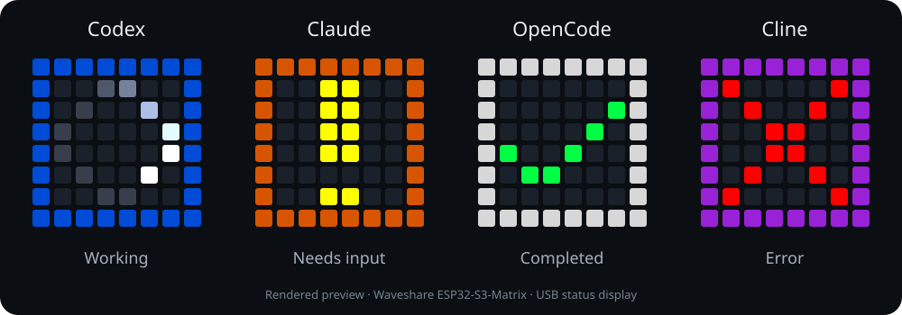

# Agent Matrix

A USB status display for your coding agents. See who is working, who needs you,
and who has finished—on a small LED matrix beside your keyboard.



**v0.1.1 preview · Windows · Waveshare ESP32-S3-Matrix · MIT**

| Agent | Border | Integration status |
|---|---|---|
| Codex | Blue | Native hooks; observed on the original installation |
| Claude Code | Orange | Native hooks; observed on the original installation |
| OpenCode | White | Local plugin; owner confirmed the live test |
| Cline desktop / SDK | Purple | Desktop fallback confirmed live; SDK plugin experimental |

The center shows a spinner for work, a blinking yellow `!` for input, a green
check for success, a red `X` for errors, or a dim dash for idle. Active agents
alternate every three seconds. Attention states take priority; multiple agents
needing attention alternate. Success clears after 30 seconds.

## What you need

- A **Waveshare ESP32-S3-Matrix** with its built-in 8×8 LEDs.
- A USB-C **data** cable and Windows PC.
- [Python](https://www.python.org/downloads/windows/) 3.12 or 3.13.
- One or more supported agent apps; accounts and models are configured separately.
- An internet connection for the initial Python dependencies and CircuitPython download.

No soldering, Wi-Fi configuration, API keys, or cloud service are needed for the
status display. The USB cable powers the board and carries status updates.
The illustrations are rendered previews, not photographs of the hardware.

## Quick start

1. Download and extract the [latest release](https://github.com/ccc6501/agent-matrix/releases),
   or clone this repository into a permanent folder. Installed adapters reference
   that folder; uninstall before moving or deleting it.
2. Put **CircuitPython 10.3.1 for this exact board** on the matrix. Follow the
   [flashing guide](docs/flashing.md). Skip this if it already runs that build.
3. Open PowerShell in the project folder and install the desktop dependencies:

   ```powershell
   .\setup.ps1 -Agents codex,claude
   ```

   Choose any combination of `codex`, `claude`, `opencode`, and `cline`. Running
   `setup.ps1` without `-Agents` asks you to choose. Use `-Agents none` for manual
   display controls only. If PowerShell blocks a downloaded script, review the
   source and use `powershell -NoProfile -ExecutionPolicy Bypass -File .\setup.ps1`
   for this invocation; no machine-wide policy change is required.
4. Copy the application to the board. Replace `E:/` with your **CIRCUITPY** drive:

   ```powershell
   .\.venv\Scripts\python.exe tools\flash.py --drive E:/
   ```

   The copier checks the board identity and backs up existing application files
   locally. It preserves an existing `board_config.py` for calibrated colors.
5. Restart the selected agent apps. In Codex, review and trust the newly installed
   hooks through its native hook review UI. Setup does not approve hooks for you.
   Start the bridge before sending the next Cline prompt.
6. Double-click **Agent Matrix** on the desktop. Choose **Run display demo** to
   check all four borders, then stop the demo to return to live status.

The launcher starts a hidden local bridge and opens its dashboard. Hooks/plugins
can also start the bridge. The demo lasts 72 seconds. Manual controls hold for 60
seconds, then live sessions take over. Two bridge copies cannot share a port.

## Check, customize, remove

```powershell
# Read-only installation and connection diagnostics
.\.venv\Scripts\python.exe tools\doctor.py

# Launch without the shortcut
.\.venv\Scripts\pythonw.exe host\launch.py

# Check board status or run a demo
.\.venv\Scripts\python.exe host\status_light.py status
.\.venv\Scripts\python.exe host\status_light.py demo

# Remove only matching Agent Matrix hooks/plugins and its unchanged shortcut
.\.venv\Scripts\python.exe tools\manage.py uninstall
```

Setup creates a private `.local/config.json` with the Python path, USB serial
number, and HTTP port. It leaves unrelated agent settings intact and stores
pre-edit backups in `.local/backups/`. Repeating the same setup does not duplicate
hooks. To change the selected agents, uninstall and rerun setup. Existing plugins
with the same name are never silently replaced.

Uninstall retains source files, the Python environment, local config/backups,
and any installed entries you edited. Restart the apps to unload adapters. Close
the running bridge before deleting its folder; uninstall does not terminate
another process or erase firmware from the board.

Edit `firmware/matrix/board_config.py` for default brightness, rotation, and RGB
order. The tested board uses **RGB**; some vendor examples use GRB. If orange
appears green, run the color check in [troubleshooting](docs/troubleshooting.md).
The default brightness is 6%; firmware caps runtime brightness at 12%.

## Compatibility and limitations

This preview supports **Windows and this board only**. It does not claim support
for WSL, remote agent runtimes, other ESP32 boards, or Cline's older VS Code
extension hook system. Experimental plugins target the local OpenCode plugin API
and Cline desktop/SDK `AgentPlugin` API. See [integration details](docs/integrations.md).

Closing a window may leave an agent running. Explicit session-end events clear
sessions; confirmed local process exits also clear Claude/OpenCode/Cline sessions.
OpenCode/Cline adapter heartbeat loss clears a session in about 20–22 seconds.
Without an end signal, Codex falls back to status expiry. No sessions means off.

Cline's SDK plugin infers permission waiting from a tool waiting more than 750 ms
before execution. The desktop fallback reads explicit question and approval events
from Cline's local status database when its plugin loader is unavailable. Start
the bridge before sending the next Cline prompt. The fallback uses an internal
database schema and remains experimental. The owner confirmed live working,
question, and completion tests for both OpenCode and Cline Desktop. Additional
approval/error/cancellation checks, cable removal/reconnection, and setup on a
second PC remain on the [manual validation checklist](docs/testing.md).

The bridge listens only on loopback. It receives session identifiers, status,
timestamps, optional process IDs, and working-folder metadata. The adapters do
not forward prompts, responses, or tool arguments. Session labels appear only in
the local dashboard. Logs omit malformed payload contents. Local processes can
control the display; this is a desktop utility, not a network service.

## Development

```powershell
python -m pip install -r requirements.txt
python -m unittest discover -s host -p "test_*.py"
node integrations/test_adapters.mjs
node tools/check_web.mjs
```

Node 22 is used for development checks; plugins run inside their agent apps and
do not require a separate Node installation for end users. Tests use temporary
settings and fake boards. GitHub Actions runs checks without physical hardware.

```text
firmware/matrix/    CircuitPython application and pure display logic
host/              Local bridge, hooks, launcher, CLI, tests
integrations/      OpenCode and Cline adapters
tools/             Setup, uninstall, diagnostics, firmware copier
web/               Local dashboard
docs/              Setup, compatibility, testing, rendered preview
```

The project keeps four identity colors in the firmware and dashboard. When adding
an agent, update the bridge's accepted agents, both renderers, and the adapter tests.
Legacy external-stick firmware is deliberately excluded from this release.

## License and credits

[MIT](LICENSE). See [third-party notices](THIRD_PARTY_NOTICES.md) for separately
installed dependencies and hardware documentation. This independent community
project is not affiliated with OpenAI, Anthropic, OpenCode, Cline, or Waveshare.
